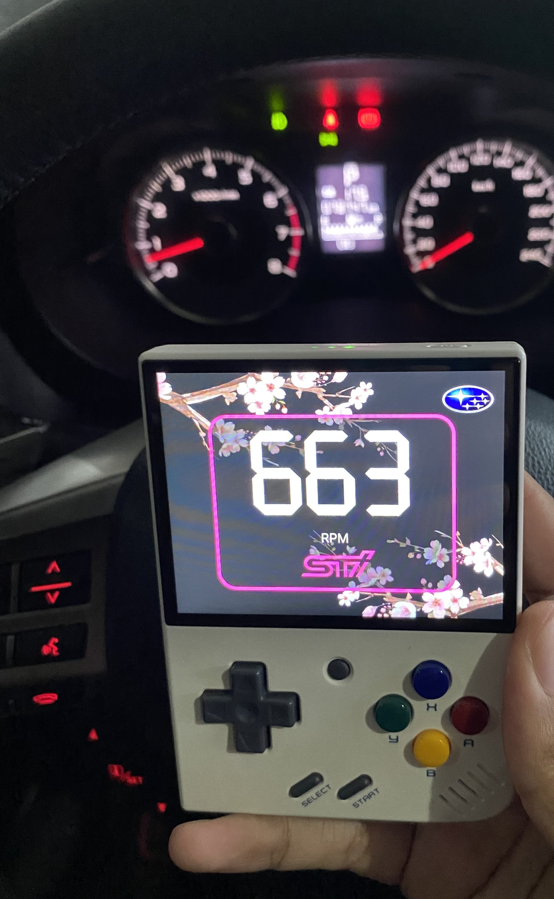
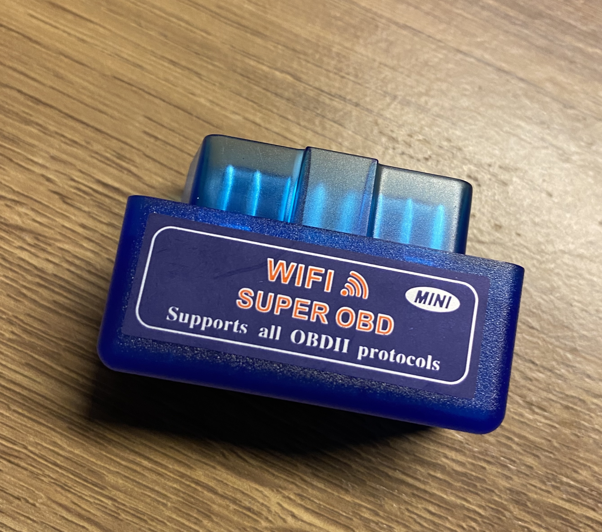

# GaugeBoy

Hey, this is the readme for the GaugeBoy project. It is a ODBII reader for the Miyoo Mini Plus.

This is a super early stage App and I only tested this on my car (Subaru Forester SJ) and with a generic WIFI ODBII Adapter I bought. The only gauge now is the RPM one. This may not work for your car, or even worse, maybe damage it, be really careful when using this software and I am in no way shape or form responsible if you brick your Miyoo Mini Plus or your car.



This is what my adapter looks like, as those are all generic ODBII adapters you can't know for sure if it will work unless you test it. In fact, this is my second adapter, the first one did not worked at all with my car



In the future I want this to support multiple types of gauges (RPM, Speed, Temperatures..), be fully customizable with a simple JSON and quickly switch between them. Performance of this app rn is also really bad, I wrote this thing using GoLang instead of C in the dumbest way possible. Memory allocations are too hard for me :weary: 

## Install
Download the .zip file from the releases, extract it and copy the GaugeBoy folder to the App/ folder on your SD card. The app should appear on your Apps. I only tested this using Onion OS.

Install the adapter on your car

Connect the Miyoo Mini Plus to the ODBII Wifi network

Open the GaugeBoy app and wait for it to connect

If you can see RPM you are very lucky

## Development

### Clone the toolchain:

```
git clone git@github.com:danfragoso/union-miyoomini-toolchain-go.git
```

 (Thank you @shauninman for the [original toolchain](https://github.com/shauninman/union-miyoomini-toolchain) and @zbtnot for [the working code example and article](https://gioarc.me/posts/games/miyoo.html))

### Install the toolchain and build a release
```
cd union-miyoomini-toolchain-go
make shell
cd workspace
git clone git@github.com:danfragoso/GaugeBoy.git
cd GaugeBoy
make
make release
```

### Work from other people
Thanks @fogleman for the GG golang library
Thank you the creators of both fonts that I'm using
Thank you the creators of all the images I'm using
If you see any work here that belongs to you and you do not want me to use it, send me a message and I'll remove it immediatly :smiley:	:+1:

